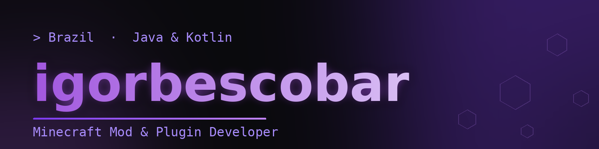
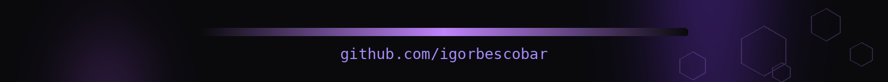

 

 

## ✦ About

Brazilian developer building **mods and plugins for Minecraft** across **Fabric, Paper, and NeoForge**. I ship polished, performance-minded gameplay systems — custom GUIs, particle effects, multiplayer networking — with a strong focus on **thread safety** and **clean, side-correct code**.

- 🟣 Creator of the **GoodStudio** Cobblemon mod lineup
- 🎮 Building **HEX-MC.NET** — a Prison / Cyber-themed network
- 🚀 Building a custom **Minecraft launcher** — a Prism Launcher fork
- 🧩 Java 8 → 25 · Kotlin · Gradle Kotlin DSL
- 🌐 PT-BR / EN

 

## ✦ Tech Stack

**Languages & Build**

**Platforms**

**Infra & Tools**

 

## ✦ What I'm Building

<table>
<tr>
<td width="50%" valign="top">

### 🧬 GoodStudio · Cobblemon Mods

Client &amp; server mods that extend the Cobblemon experience — particle auras, social &amp; connection systems, custom titles, and bespoke GUIs.

</td>
<td width="50%" valign="top">

### 🎮 HEX-MC.NET

A Prison / Cyber-themed Minecraft network with custom MiniMessage MOTD, purple gradient branding, and integrated voice chat.

</td>
</tr>
</table>

 

## ✦ GitHub Stats

 

 

## ✦ Connect

 

